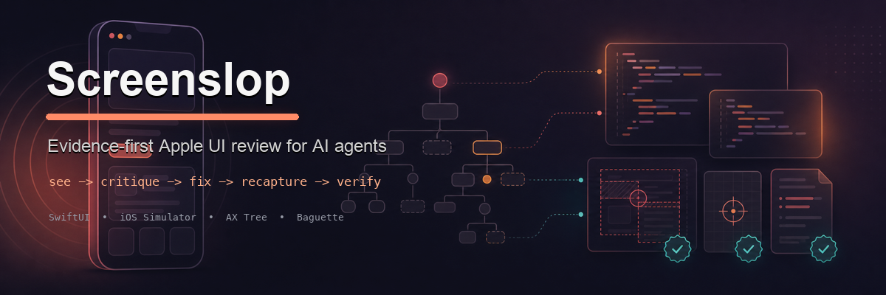

<p align="center">
  
</p>

# Screenslop — Evidence-first Apple UI review | SwiftUI design QA

I built Screenslop because AI can now generate SwiftUI faster than I can make coffee, which is both impressive and mildly suspicious. The problem is that "it compiles" is a very low bar for Apple UI. A screen can compile, launch, and still feel like it was assembled by a tutorial screenshot with ambition.

Screenslop reviews Apple app UI from runtime evidence. It runs or connects to the app, captures the actual screen, reads the accessibility tree, inspects logs and source hints, then produces findings an agent can fix and verify with a fresh capture.

Works with Codex, Claude Code, Cursor, plain terminal workflows, Baguette-backed capture, and XcodeBuildMCP build/run support. Lower-level `xcodebuild` / `simctl` capture fallback is planned, not shipped yet.

---

## Install

### From GitHub

```bash
npm install -g github:gabelul/screenslop#v0.1.0
screenslop doctor
```

### Local development

```bash
git clone https://github.com/gabelul/screenslop.git
cd screenslop
npm install
node bin/screenslop.mjs doctor
npm test
```

You can also run it without linking:

```bash
node bin/screenslop.mjs see --dry-run --json
```

### Agent skill install

The CLI and the agent skill are separate. Install the CLI first, then install the skill so Codex, Claude Code, Cursor, or another agent knows the runtime-first loop.

Preview the packaged skill:

```bash
npx skills add gabelul/screenslop --list
```

Install it:

```bash
npx skills add gabelul/screenslop --skill screenslop
```

Manual paths and scope notes live in [Skill installation](docs/skill-installation.md).

---

## What Screenslop does

Screenslop is the boring, scriptable engine that sits between AI agents and real Apple UI evidence.

1. **Set up the target** — detect project metadata with `screenslop setup`, then create or migrate `.screenslop/config.json` with scheme, bundle ID, source root, device, surface, and artifact folder settings.
2. **Capture the screen** — use Baguette for the shipped live capture path to write screenshot, AX tree, logs, manifest, and summary files.
3. **Critique the evidence** — produce deterministic findings with proof, not vague taste complaints.
4. **Fix selected findings** — patch only narrow, high-confidence SwiftUI issues.
5. **Verify with fresh evidence** — recapture, critique again, and compare the old finding against the new evidence.
6. **Stress the first matrix** — write a bounded six-cell device/settings report with one evidence bundle per cell.

The current MVP is intentionally conservative. It does not pretend a fixture test proves your real app is fixed. It does not edit the whole codebase because one button has a bad accessibility name. It does the small proven thing, then asks for fresh evidence. Annoying? Slightly. Correct? Yes.

---

## Core workflow

```bash
screenslop setup --json --dry-run
screenslop setup --json --yes
screenslop doctor

screenslop see --surface Settings --json
screenslop critique artifacts/<baseline-run> --json

screenslop fix artifacts/<baseline-run> \
  --finding <finding-id> \
  --source-root <app-source-root> \
  --apply \
  --yes \
  --label "Save settings" \
  --json

screenslop see --surface Settings --json
screenslop critique artifacts/<fresh-run> --json

screenslop verify artifacts/<baseline-run> \
  --fresh-bundle artifacts/<fresh-run> \
  --finding <finding-id> \
  --fix-session artifacts/<baseline-run>/fix-session.json \
  --json
```

No fresh capture means no verified fix claim. That rule saves a lot of nonsense.

---

## Commands

| Command | Status | What it does |
| --- | --- | --- |
| `screenslop init` | MVP | Creates or migrates local project config. |
| `screenslop doctor` | MVP | Checks Baguette, XcodeBuildMCP, Xcode, simctl, Swift, and Node. |
| `screenslop see` | MVP | Captures screenshot, accessibility tree, logs, manifest, and summary. |
| `screenslop critique` | MVP | Turns evidence into findings with proof. |
| `screenslop fix` | MVP | Plans or applies selected safe SwiftUI fixes. |
| `screenslop verify` | MVP | Compares baseline findings against fresh critique output. |
| `screenslop matrix` | MVP | Writes a bounded six-cell matrix report and evidence bundles. |
| `screenslop watch` | Future | Placeholder for the live review loop. Not shipped yet. |

Full command notes live in [docs/commands.md](docs/commands.md).

---

## Runtime priority

Screenslop prefers real runtime evidence whenever it can get it:

1. **Baguette** — shipped live capture path for simulator screenshots, AX tree, logs, and runtime control.
2. **XcodeBuildMCP** — shipped build/run path for the sample smoke and matrix live cells.
3. **xcodebuild + simctl** — planned lower-level fallback for local machines.
4. **Manual evidence** — screenshot/source evidence when automation is not available.

The rule is simple: do not critique Apple UI from source alone when runtime evidence can be captured. In v0.1, real `see` capture still needs Baguette; the rest of the stack is build/run support or future fallback work.

---

## Evidence bundles

A `see` run writes a bundle like this:

```text
artifacts/<run-id>/
  evidence.json
  screenshot.jpg
  accessibility.json
  logs.ndjson
  summary.md
```

`critique`, `fix`, and `verify` add their own artifacts next to the evidence so agents can pass a single bundle around without losing context.

---

## Project config

Local target metadata lives in `.screenslop/config.json` and is intentionally ignored by git because it can contain private app paths and bundle IDs.

Important fields:

```json
{
  "schemaVersion": 1,
  "preferredRuntime": "baguette",
  "defaultSurface": "Settings",
  "defaultScheme": "MyApp",
  "defaultBundleId": "com.example.MyApp",
  "defaultDevice": "iPhone 17",
  "workspacePath": "MyApp.xcworkspace",
  "sourceRoot": "MyApp",
  "artifactsDir": "artifacts"
}
```

`schemaVersion: 1` is the v0.1 generation. During 0.x, config changes are allowed, but they need an explicit migration path. No silent drift.

---

## Verification commands

Before claiming the repo is healthy:

```bash
node bin/screenslop.mjs doctor
npm test
npm run --silent smoke:e2e -- --fresh-mode fixed
node bin/screenslop.mjs matrix --dry-run --json
node bin/screenslop.mjs matrix --profile examples/matrix/default.json --json
npm run cleanup:macos:dry
npm pack --dry-run
npm run --silent smoke:package
```

When Apple runtime tools are available:

```bash
npm run smoke:runtime
```

That smoke builds and launches `examples/runtime-smoke-app`, captures Baguette-backed baseline and fresh evidence, applies one narrow fix, and verifies the selected finding. It proves the sample app loop. Your app still needs its own capture because reality insists on being specific.

---

## Repo boundary

Screenslop is the public engine repo:

- CLI
- core runtime/finding/fix/verify logic
- schemas
- docs
- agent skill/integration files
- sample app and smoke tests

Screenslop Studio is the future private Mac app wrapper. Studio should consume this engine, not duplicate the critique logic in another corner of the universe because apparently one source of truth was too relaxing.

Studio is deliberately blocked until the engine proves the boring stuff:

- JSON and schema contracts for agent-facing commands
- package smoke from the packed npm tarball
- sample runtime smoke with fresh capture and verified fix
- six-cell matrix output with clear setting status
- configured-target preflight with redacted failures
- one private dogfood finding verified as `verified-fixed` from fresh real-app evidence
- machine-checked redaction before any dogfood lesson becomes public
- agent docs that match what the CLI actually ships

So no `apps/mac/` placeholder here, no private wrapper scaffold, and no second
critique engine hiding in a corner. Studio can be pretty later. The engine has
to be trustworthy first.

Read more in [docs/repo-strategy.md](docs/repo-strategy.md).

---

## Documentation map

- [Getting started](docs/getting-started.md)
- [Agent playbook](docs/agent-playbook.md)
- [Skill installation](docs/skill-installation.md)
- [Command model](docs/commands.md)
- [Architecture](docs/architecture.md)
- [Agent integrations](docs/agent-integrations.md)
- [Repo strategy](docs/repo-strategy.md)
- [Known limitations](docs/known-limitations.md)
- [Release checklist](docs/release-checklist.md)
- [Changelog](CHANGELOG.md)

---

## Related

Other tools for agents that care about quality:

- **[slopbuster](https://github.com/gabelul/slopbuster)** — AI text cleanup for prose, comments, and documentation that sound a bit too machine-polished.
- **[pixelslop](https://github.com/gabelul/pixelslop)** — browser-first visual quality checks for web UI.
- **[stitch-kit](https://github.com/gabelul/stitch-kit)** — design skills and workflows around Google Stitch MCP.
- **[claude-code-skill-activator](https://github.com/gabelul/claude-code-skill-activator)** — skill auto-detection for Claude Code.

---

Apache-2.0.

Built by Gabi @ [Booplex.com](https://booplex.com) because AI-generated UI should still have to pass the "does this feel like a real app?" test.
